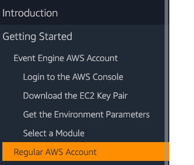

## Streaming Data to Amazon MSK via AWS DMS

This repository provides you cloudformation scripts and sample code on how to implement
end to end pipeline for replicating transactional data from Aurora Postgresql DB to Apache Kafka.


## Purpose

Demo converting postgresql database to postgresql using postgresql and PostgresSQL RDS instances with SCT and DMS.  Additional option to use Kinesis in between DMS and Aurora.


&nbsp;

## Outline

- [Overview](#overview)
- [AWS Services Used](#aws-services-used)
- [Technical Overview](#technical-overview)
- [Instructions](#instructions)
  - [Create Environment](#create-environment)
  - [Troubleshoot Environment](#troubleshoot-environment)
  - [Verify Kafka](#verify-kafka)
  - [PG Table Population](#pg-table-population)
  - [Verify Kafka Records](#verify-kafka-records)
- [Cleaning up](#cleaning-up)


&nbsp;

## Overview

This demonstates setting up a DMS and Kafka pipeline with Aurora Postgresql as the source database.  Initially started with CloudFormation template from [Streaming data to Amazon Mangaed Streaming for Apache Kafka](https://github.com/aws-samples/aws-dms-msk-demo/blob/master/content/cfn/master-cfn.yaml).  This template was written in support of [this blog on DMS and Kafka](https://aws.amazon.com/blogs/database/streaming-data-to-amazon-managed-streaming-for-apache-kafka-using-aws-dms/).  

## AWS Services Used

* [AWS DMS Database Migration Service](https://aws.amazon.com/dms/)
* [AWS Cloudformation](https://aws.amazon.com/cloudformation/)
* [Amazon Managed Streaming for Apache Kafka (MSK)](https://aws.amazon.com/msk/)
* [Amazon RDS](https://aws.amazon.com/rds/)

## Technical Overview

* Start up environment
* Generate Load to Aurora Postgresql 
* Verify records replicated to MSK
* Contemplate mapping techniques

&nbsp;

---

&nbsp;

## Instructions

***IMPORTANT NOTE**: Creating this demo application in your AWS account will create and consume AWS resources, which **will cost money**.  Costing information is available at [AWS DMS Pricing](https://aws.amazon.com/dms/pricing/)   The template will cost money for the other resources as well.

&nbsp;

### Create Environment
An unusual part of this cloud formation yaml file is the use of a custom endpoint.  A lambda function is used to deploy the DMS kafka target endpoint.  This is really due to a limitation in being able to output the broker list using the cloudformation stack.  Because of this limitation, the lambda function looks up this broker list and then creates the DMS endpoint.  Additional endpoints can be made manually or added to the labmda function.

* Some tips on creating an AWS account with [AWS Account instructions](https://dms-immersionday.workshop.aws/en/envconfig/regular.html)
* After reviewing  "Introduction" and "Getting Started", follow the Regular AWS Account instructions. 
* Complete the "Login to the AWS Console" and "Create an EC2 Key Pair" steps
* Several scripts are in the github to streamline the environment creation
    * first step is to customize the setEnvironment script for the project name
    * the setEnvironment will get local IP address to open this IP to access AWS resources in the security group
    * cd template and edit the file "setEnvironment.sh"
```bash
cd template
. ./setEnvironment.sh
./awsdeploy1.sh
```
    * The pipeline should be up and running in 15-20 minutes
    * on stack completion open the stack.out file to find the output variable for the MSK cluster ARN held in the parameter "StreamingBlogMSKCluster".  This value will be needed to look up the MSK cluster brokers
```bash
./getBrokers.sh arn:aws:kafka:us-east-1:569119288395:cluster/StreamingBlogMSKCluster/54405a9e-96f5-494c-84ae-4a48f15e2b9f-13
```
    * Can deploy additional DMS endpoints and tasks dependent on this broker list

### Troubleshoot Environment
* Can have issues with dms role creation.  If the dms-vpc-role already exists, an error will be given the CFN script will fail and rollback.  Either delete existing dms-vpc-role or remove its definition from the CFN script.
* Lambda runtime python version.  Must be able to get to the correct python runtime. [this cfn-response discussion covers this](https://aws.amazon.com/premiumsupport/knowledge-center/cloudformation-cfn-response-lambda/)

### Verify kafka
Login to the EC2 instance and verify the MSK is running using installed Kafka tools
* Open a new ssh session to the client EC2.
* Verify message queue is reachable and empty
    * [Refer this link](https://docs.aws.amazon.com/msk/latest/developerguide/msk-get-bootstrap-brokers.html) to get broker list for the kafka-topic command.
```bash
ssh -i <pemfile> ec2-users@ec2IPAddress
kafka/kafka_2.12-2.2.1/bin/kafka-topics.sh --list --bootstrap-server b-1.streamingblogmskclust.rvq2us.c13.kafka.us-east-1.amazonaws.com:9092,b-2.streamingblogmskclust.rvq2us.c13.kafka.us-east-1.amazonaws.com:9092
```

### PG Table Population
* Create tables and generate some records in to the Postgresql table
```bash
cd
git clone https://github.com/devrimgunduz/pagila.git
cd pagila
psql -d AuroraDB -h jph-dms-kafka-source-1.cykwyngishlk.us-east-1.rds.amazonaws.com -U master -f pagila-schema.sql
# ignore alter table errors as these are alter to owner "postgresql" and our master user is master (unless changed)
```
* Populate the tables
```bash
cd
git clone https://github.com/devrimgunduz/pagila.git
cd pagila
psql -d AuroraDB -h jph-dms-kafka-source-1.cykwyngishlk.us-east-1.rds.amazonaws.com -U master -f pagila-data.sql
# ignore alter table errors as these are alter to owner "postgresql" and our master user is master (unless changed)
```

### Start DMS replication 
Now, let’s Start DMS task via aws cli so as our data starts getting replicated to MSK. Before running replace the DMS task ARN. You can find it in the AWS Console, under DMS service.
```bash
aws dms start-replication-task --replication-task-arn <dms task arn> --start-replication-task-type start-replication --region <regionid>
```
### Verify Kafka Records
```bash
kafka/kafka_2.12-2.2.1/bin/kafka-console-consumer.sh --topic dms-blog --bootstrap-server b-1.streamingblogmskclust.rvq2us.c13.kafka.us-east-1.amazonaws.com:9092,b-2.streamingblogmskclust.rvq2us.c13.kafka.us-east-1.amazonaws.com:9092
```

### Cleaning up
* Stop the DMS Replication task by replacing the ARN in below command.
```bash
aws dms stop-replication-task --replication-task-arn <dms task arn> --region <regionid>
```
* Delete the CloudFormation stack.
* Clean the resources that are dynamically created.
  * Go to Services, then DMS and click endpoints in the left navigation.
  * Delete “dms-blog-kafka-target” DMS endpoints. 
* Delete any CloudWatch log-groups if got created.
  * Go to Services, then CloudWatch and click “Log groups” in the navigation pane.
  * Delete any Log groups with name “Streaming-DMS-MSK” or use the stack name if you changed it from default while creating the stack.
* Delete MSK Cluster Configuration.
  * Go to Services, then MSK and click cluster configuration in the left navigation.
  * Delete any configuration with name containing "Streaming-Blog-MSKCluster" in it.
&nbsp;

---

&nbsp;
